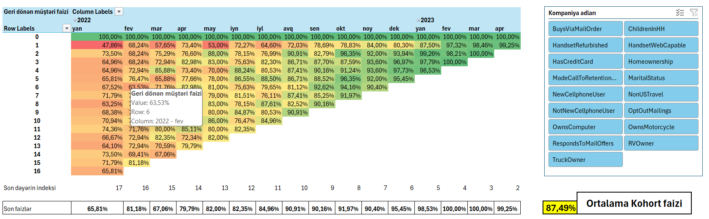
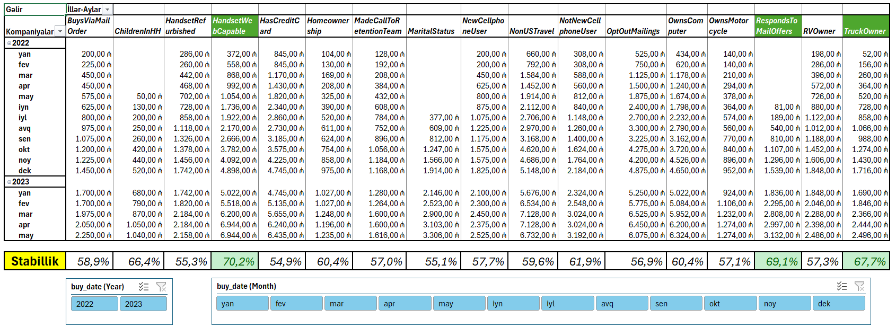
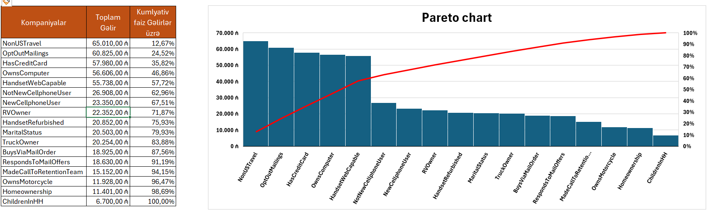
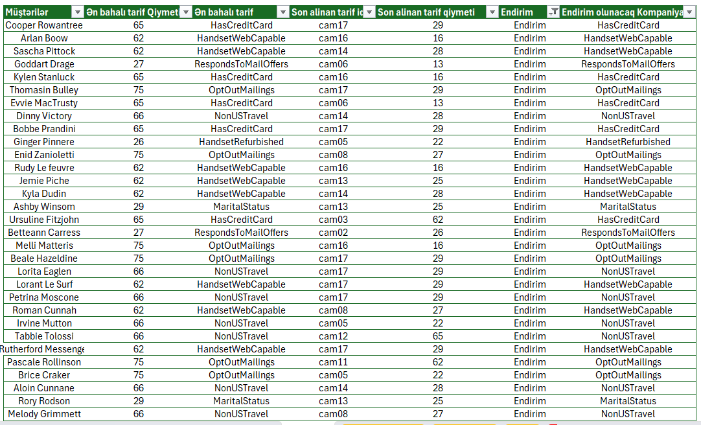

# Telekom Marketinq Analitikası (Excel)

Telekom datası üzərində qurulmuş, üç mənbə cədvəlinə (Kompaniyalar, Müştərilər, Satış) əsaslanan tam həcmli marketinq analitikası layihəsi. Analiz müştəri davranışlarının davamlılığını, gəlirin sabitliyini, gəlirin konsentrasiyasını və çarpaz satış/endirim tövsiyə sistemini əhatə edir.

## Əsas Nəticələr

|Göstərici|Nəticə|
|-|-|
|Ortalama kohort faizi|**87,46%**|
|Əsas gəlir konsentrasiyası|**5 kompaniya ≈ ümumi gəlirin 60%-i** (Pareto)|
|Stabillik liderləri|Gəlir sabitliyinə görə TOP 3 kompaniya (2023-cü ilin son 5 ayı)|
|Endirim imkanı|Son istifadə etdiyi tarif tarixindəki ən bahalı tarifi olmayan müştərilər müəyyən edilib|

## Data haqqında

Bir-biri ilə əlaqəli üç cədvəl:

* **Kompaniyalar** — kompaniya səviyyəsində atributlar
* **Müştərilər** — müştəri səviyyəsində atribut və seqmentlər
* **Satış** — tranzaksiya/aylıq gəlir qeydləri

> Data anonimləşdirilib / yalnız portfolio məqsədi ilə istifadə olunur.

## Analizin Təfərrüatı

### 1\. Kohort Analizi

Müştərilər qoşulma ayına görə qruplaşdırılıb; davranış davamlılığını ölçmək üçün ay-ay üzrə retention izlənilib. Bütün kohortlar üzrə ortalama retention **87,46%** təşkil edir. İnteraktiv slicer vasitəsilə görünüş kompaniya adına görə filtrlənə bilir.

### 2\. Gəlir Sabitliyi Analizi

Hər kompaniyanın aylıq gəliri stabillik göstəricisinə çevrilərək hansı kompaniyaların sabit (aşağı dəyişkənlikli), hansıların isə qeyri-sabit gəlir gətirdiyi müəyyən edilib. İl/ay slicer-ləri ilə 2023-cü ilin son 5 ayına filtrlənib, şərti formatlaşdırma isə TOP 3 ən stabil kompaniyanı vurğulayır.

### 3\. Pareto Analizi

Kompaniya üzrə gəlirin Pareto diaqramı (sütunlar + kumulyativ % xətti) gəlirin 80/20 tipli konsentrasiyasını müəyyən edir. **NonUSTravel, OptOutMailings, HasCreditCard, OwnsComputer, HandsetWebCapable** kompaniyaları birlikdə ümumi kompaniya gəlirinin təqribən **60%**-ni təşkil edir və strateji fokusun ən çox gətiri verəcəyi sahələri göstərir.

### 4\. Endirim / Çarpaz Satış Tövsiyəsi

Hər müştərinin tarixi tarif istifadəsi son istifadə etdiyi tarif ilə müqayisə edilir. Əgər son tarif həmin müştərinin istifadə etdiyi ən bahalı tarif deyilsə, daha yüksək səviyyəli tarif üzrə hədəflənmiş endirim kampaniyası tövsiyə olunur ki, müştəri yenidən cəlb edilsin.

## Alətlər və Metodlar

Excel · PivotTable-lar · Slicer-lər · Şərti Formatlaşdırma · Kohort Analizi · Pareto Analizi · Variasiya Əmsalına Əsaslanan Stabillik Hesablaması

## Fayl

(result/Tam_marketinq_analizi_TELEKOM_data.xlsx)

## Müəllif

**Rufat** — Data Analyst
[Medium](#) · [LinkedIn](#)

